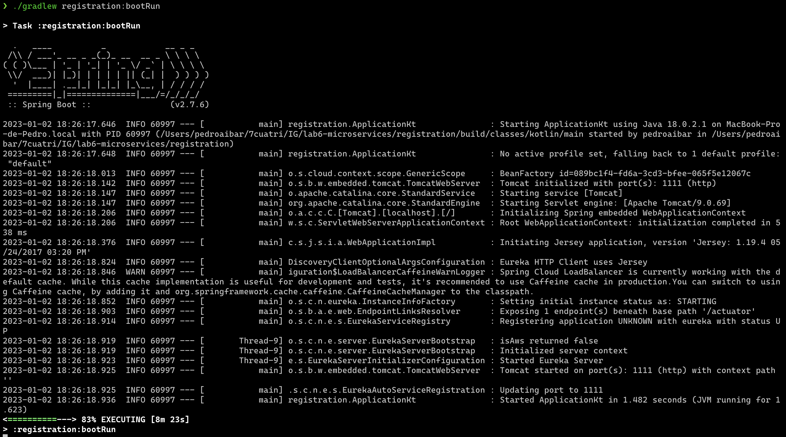
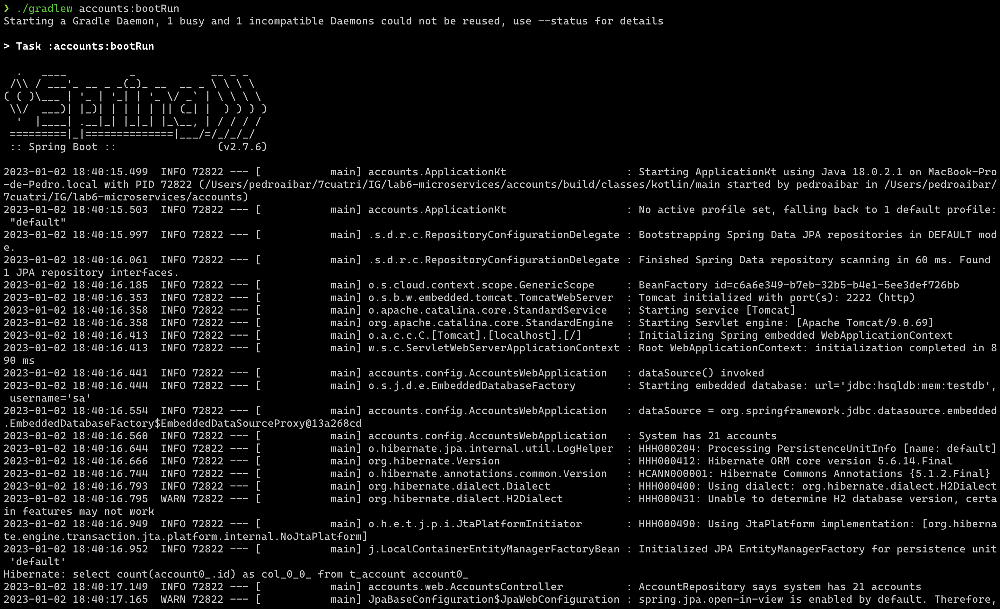
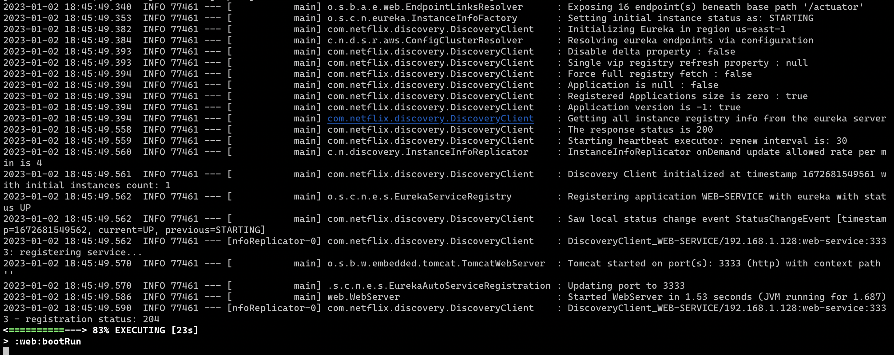
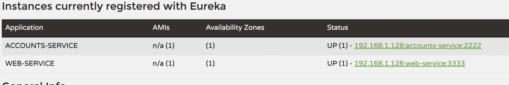
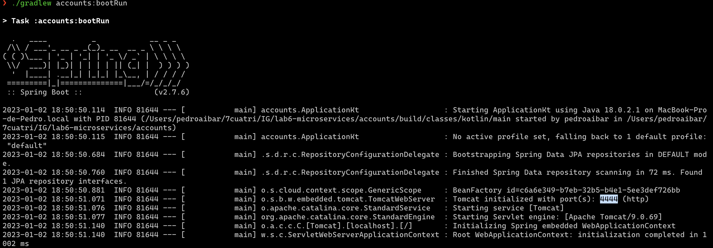
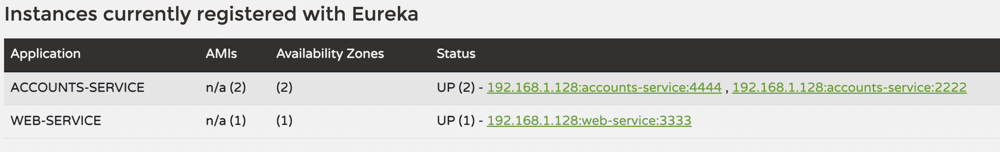
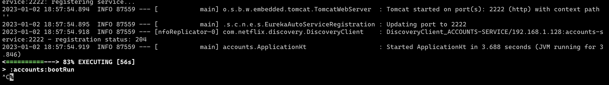

# REPORT

This document contains a brief of how the following activities have been accomplished:

- The two services `accounts (2222)` and `web` are running and registered (two terminals, logs screenshots).
- The service registration service has these two services registered (a third terminal, dashboard screenshots)
- A second `accounts` service instance is started and will use the port 4444. This second `accounts (4444)` is also
  registered (a fourth terminal, log screenshots).
- What happens when you kill the service `accounts (2222)` and do requests to `web`?  
  Can the web service provide information about the accounts again? Why?

## Steps

The registration server is exposed in `http://localhost:1111`.



The account service is exposed in `http://localhost:2222`.


The account service is registered in the registration server, as shown in the following screenshot:


The third application, the web service, is launched on port 3333.



The following screenshot shows that these two services are registered in the registration server:


The port of the account service is changed to 4444, as shown in the following configuration:
```yaml
spring:
  application:
    name: accounts-service  # Identify this application
# HTTP Server
server:
  port: 4444   # HTTP (Tomcat) port
```

The new account service is launched, as shown in the following screenshot:


There are three services registered in the registration server, as shown in the following screenshot:


The account service at port 2222 is shut down, as shown in the following screenshot:



When an account is fetched, the request still succeeds, as shown in the following screenshot:


When the accounts (2222) service is shut down and requests are made to the web service, the request still succeeds in fetching account information. This is because the web server searches for the accounts service in the Eureka server (where all the services are registered), and it finds the accounts service running on port 4444. Even though the accounts service on port 2222 has been shut down, the web service is able to obtain the necessary information from the second instance on port 4444.